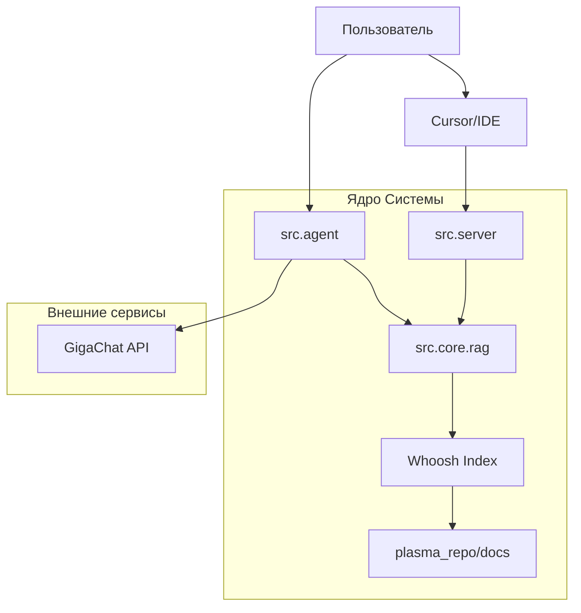

# Архитектура Plasma AI Assistant

Проект представляет собой связку AI-агента и MCP-сервера для работы с документацией Plasma UI Kit.

## Схема взаимодействия

## Основные компоненты

### 1. RAG Core (`src/core/`)
- **Indexer**: Сканирует `.mdx` файлы в репозитории Plasma и строит поисковый индекс с помощью библиотеки **Whoosh**.
- **RAG**: Обеспечивает семантический поиск по ключевым словам и токенам.

### 2. AI Агент (`src/agent.py`)
- CLI-приложение на базе **GigaChat**.
- Использует инструменты RAG для поиска ответов на вопросы пользователя прямо в терминале.

### 3. MCP Сервер (`src/server.py`)
- Реализован на базе **FastMCP**.
- Предоставляет инструменты (`ask_plasma`, `get_token`, `list_components`) для внешних клиентов.
- Использует транспорт **Streamable HTTP** на эндпоинте `/mcp`.

### 4. Конфигурация
- Все настройки хранятся в `.env`.
- Обязательно определение путей к репозиторию и индексу для исключения неопределенности при запуске из разных директорий.

## Технологический стек
- **Python 3.10+**
- **Whoosh**: Поисковый движок.
- **FastMCP**: Реализация протокола MCP.
- **GigaChat**: Языковая модель.
- **Pydantic**: Валидация данных.
